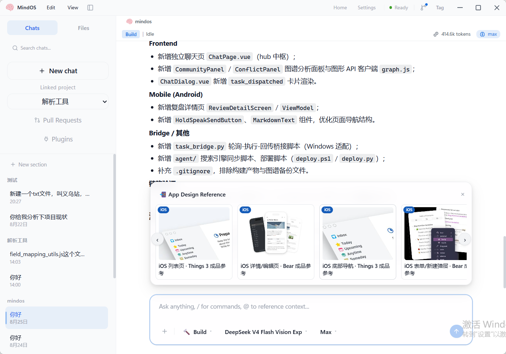
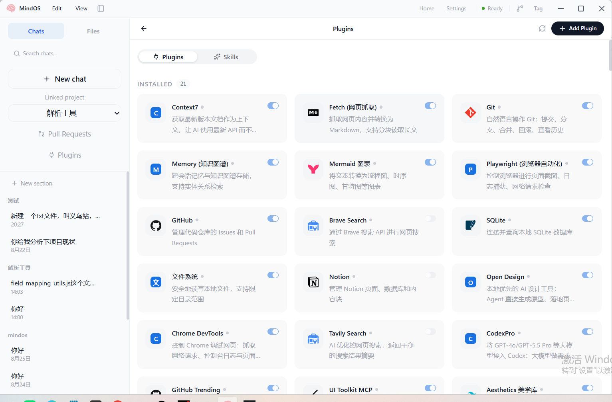
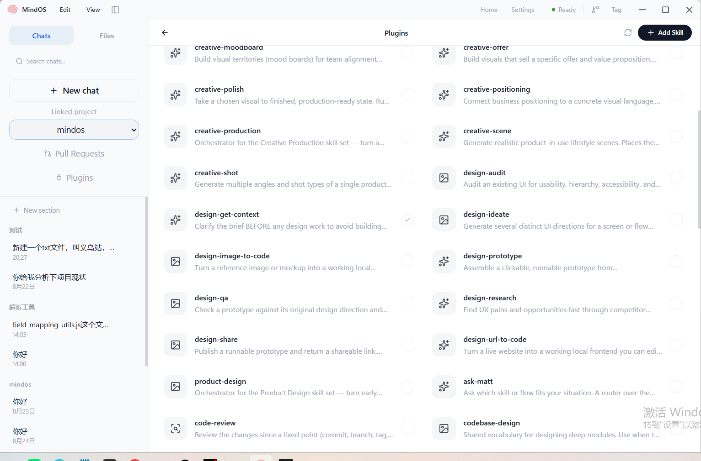

# MindOS Desktop

[中文](README.md) · [English](README.en.md)

> **MindOS Desktop — Your desktop AI coding assistant.**
> Ready out of the box, local-first, powered by the built-in Codex engine. You describe the need; it writes code, fixes bugs, runs commands, builds pages — even opens pull requests.
>
> ✅ **100% local. No code, chat history, or files are ever collected.** Your data is only sent to the AI service you configure (DeepSeek / OpenAI, etc.); everything else stays on your machine.

---

## Contents

- [Get started in 3 easy steps](#get-started-in-3-easy-steps)
- [Step 1: Download & install](#step-1-download--install)
- [Step 2: Create a project](#step-2-create-a-project)
- [Step 3: Connect a model and start chatting](#step-3-connect-a-model-and-start-chatting)
- [Plugins & skills](#plugins--skills)
- [A quick tour of the UI](#a-quick-tour-of-the-ui)
- [Permissions & approvals](#permissions--approvals)
- [Git & pull requests](#git--pull-requests)
- [Auto-update](#auto-update)
- [FAQ](#faq)
- [Privacy & security](#privacy--security)
- [Developers](#developers)

---

## Get started in 3 easy steps

1. Install MindOS (~270 MB; the portable ZIP needs no installation)
2. Click **New project** on the home page and pick your code folder
3. Connect an AI model in Settings (DeepSeek / OpenAI — a key takes ten minutes), go back to the chat and type "help me build XX" — away you go.

> The picture above is the main chat screen: history on the left, the AI's work in the middle, and reference cards it generates in the panel.

---

## Step 1: Download & install

**Requirements:** Windows 10 / 11 64-bit.

| Build | Description |
|---|---|
| `MindOS Setup 0.1.0.exe` | Installer — next, next, done; choose your install directory |
| `MindOS-0.1.0-win.zip` | Portable — extract anywhere, double-click `MindOS.exe` |

**Where to get it:** GitHub Releases (see FAQ if it is slow).

**First-launch SmartScreen:** the build is unsigned (normal for indie software); Windows may show "Windows protected your PC" — click **More info → Run anyway**. Only the first time.

After launch you will see the main window. The title bar shows **● Ready** once the engine is ready.

---

## Step 2: Create a project

1. Click **New project** on the home page
2. Pick a **code folder** (e.g. `D:\my-website`)
3. Wait for the engine to be ready (**● Ready** in the title bar)

> Tip: use a short path with no spaces (`D:\...`). Weird failures are often path parsing first.

---

## Step 3: Connect a model and start chatting

The AI needs a model you can use. Pick one:

### DeepSeek (great value)
1. Open `platform.deepseek.com` → register → **API Keys** → create one (`sk-...`)
2. MindOS **Settings → Model** → find DeepSeek → paste key → Connect
3. Select it as the current model

### OpenAI-compatible APIs
1. Apply for a key on your provider (OpenAI / Alibaba Bailian / SiliconFlow, etc.)
2. Settings → Model → add service URL + key → Connect

### Start chatting
Back to the chat:
- Type directly: **"Fix the login button error"**
- Paste an error: **"This code crashed: ...(paste)"**
- Delegate: **"Audit this module's security"**

While the AI works:
- Actions that need confirmation (file edits, commands) pop an **approval dialog** — click Allow; that's normal
- Changed files appear as **change cards** in the stream (lines + path)
- Prototypes (web pages / components) **preview right in the chat**

---

## Plugins & skills

MindOS ships built-in plugins and skills, toggled in one click — no CLI:

- **Plugins** — web search, databases, browser automation, charts, GitHub, etc.:
  
- **Skills** — creative/design/product workflow templates (moodboard, code-review, design→code…):
  

> Want the AI to look something up or draw a chart? Toggle the plugin in Settings; turn it off anytime.

---

## A quick tour of the UI

| Area | What it is |
|---|---|
| **Title bar** | Home/Settings nav; **● Ready** status; environment-info button (icon) |
| **Chat** | Main area — the AI's full working process + results |
| **Right panel** | File preview / built-in browser / console / context / Git; the "Tag" button toggles it |
| **Environment info** | Title-bar icon — changes, isolation status, commit / push / PR |

---

## Permissions & approvals

In **Settings → Permission Center**, choose who approves the AI's actions:

| Mode | Experience | Good for |
|---|---|---|
| **Standard approval** (recommended) | Every sensitive action (commands, file edits) asks you | First-timers / cautious |
| **AI review (trust mode)** | The AI assesses risk; most actions run, risky ones still ask you | Familiar projects, want speed |
| **Full trust** | No prompts; everything allowed inside the sandbox runs directly (out-of-sandbox is denied) | Fully automated batches |

> Sandbox: the AI runs commands in a controlled sandbox; writes outside your project directory are blocked and reported. Safe for you.

---

## Git & pull requests

The AI works in an **isolated worktree** by default (doesn't dirty your main folder). The **environment info** button shows "Isolated / Not isolated":

- **Commit** — commit the current environment's changes (a branch must exist — that's what "Create branch" is for)
- **Push** — push the current branch to GitHub
- **New PR / Open PR** — one click after pushing; merge on GitHub and come back to see "Merged"

> Advanced: let the AI own the loop — "fix the bug and open a PR." It commits, pushes, and creates the PR; you just merge.

---

## Auto-update

MindOS checks for a new version **on each restart** (no tracking data, nothing uploaded):

- New version found → toast: "New version v0.2.x available"
- Click **Update** → downloads in the background → "Restart to apply"
- Click **Later**: silence — reminded again on the next launch

---

## FAQ

**Q: Download slow / cannot reach GitHub?**
Use the mirror link (see the release page/comment for a CDN/mirror copy). The assets live on GitHub.

**Q: "No model"**
Settings → Model → Connect a model (any DeepSeek/OpenAI-compatible key from the provider's site).

**Q: The AI does nothing / "Could not connect"?**
Check your network/proxy — it must reach the model API you configured.

**Q: Where are the logs?**
`%AppData%\mindos-desktop\logs\` — zip the whole folder and send it over.

**Q: Only 8 GB RAM?**
It runs. Don't run heavy multi-project sessions at once; finish one task before starting the next when slow.

---

## Privacy & security

In one sentence:

> **100% local. Nothing is collected — no code, no chat history, no files.** Data is used only to talk to the AI service you configured (DeepSeek/OpenAI, etc.). No telemetry, no tracking, no uploads.

- Conversations and project files live **only on your machine**
- No account system — you never sign up for any MindOS account
- Git operations touch only your local repo and the remotes you authorized

---

## License & distribution

MindOS Desktop is **closed-source free software**; the distribution terms are in [`LICENSE.md`](LICENSE.md):

- Allowed: install & run on personal machines; read bundled open docs for learning/research/internal testing
- Prohibited: **reverse engineering / decompilation**, any **commercial use**, redistribution/resale, removal of copyright marks
- Exception: third-party components (e.g. openai/codex, Apache-2.0) remain under their original licenses (see architecture doc §5)

---

## Developers

> Source is not distributed publicly; notes for self-builders/contributors.

**Stack**: Electron (main) + Vue 3 + Pinia (renderer) + node-pty (terminal) + `codex-cli 0.149.0` (AI kernel, external process).

**Common commands**:

| Command | Purpose |
|---|---|
| `npm install` | Install deps |
| `npm run dev` | Dev mode (main process built by vite-plugin-electron; codex from local PATH) |
| `npm test` | Full unit test run (vitest) |
| `npm run typecheck` / `npm run lint` | vue-tsc + electron tsc |
| `npm run pack:mirror` | Windows packaging (CN npm mirror, no VPN needed) |
| `npm run release:win` | Windows packaging + publish to GitHub Release (after tagging) |

**Architecture**: [`docs/ARCHITECTURE.md`](docs/ARCHITECTURE.md) — a professional overview (layered topology, session/approval/filesystem/git-isolation/plugins/terminal/lifecycle chains, task routing, auto-update, upgrade discipline). Implementation details: [`docs/features/`](docs/features/); maintenance rules: [`AGENTS.md`](AGENTS.md) (test/typecheck/coverage red line/commit conventions).

**Packaging & distribution**:

- Output goes to `D:/MindOS-Dist`, fully separated from source: installer exe / portable zip / win-unpacked folder / latest.yml (upload for releases)
- `scripts/pre-dist-check.mjs` runs pre-package security checks (**no sourcemaps, no local path leaks**) — the minimal anti-decompilation set; main/preload bundles are minified
- Network: `ELECTRON_MIRROR` / `ELECTRON_BUILDER_BINARIES_MIRROR` are baked into `pack:mirror`; `electronDist` reuses the locally installed Electron to avoid re-downloads

**License & attribution**:

MindOS Desktop integrates the official build of [openai/codex](https://github.com/openai/codex) (Apache-2.0), `codex-cli 0.149.0`, as an independent external process over the app-server protocol. **No source of theirs is modified or derived**; the adapter layers (protocol/IPC/renderer) are original MindOS code. All rights and attribution remain with OpenAI and the codex project contributors. See §5 of [`docs/ARCHITECTURE.md`](docs/ARCHITECTURE.md).

---

*v0.1.0 · exploration release — feedback welcome: include your environment, screenshots, and logs*
